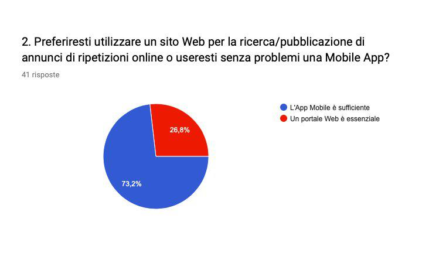

# **UNIMIB Tutoring Assistant - Elicitation Strategy**

## **Group 25 - Composition:** 

* Bettini Ivo Junior (806878) @ i.bettini@campus.unimib.it
* Beltramelli Fabio (816912) @ f.beltramelli@campus.unimib.it
* Tramontana Giuseppe (765917) @ g.tramontana@campus.unimib.it

## **GitLab Repository**
[2019_assignment2_unimib_tutoring_assistant](https://gitlab.com/i.bettini/2019_assignment2_unimib_tutoring_assistant)

## **APPLICATION OVERVIEW**

**UNIMIB Tutoring Assistant** is a to-be-developed _Mobile Application_ aiming to provide a simple yet powerful tool for handling private tutoring among students of the _University of Milano-Bicocca_.

The core concept behind this application is to allow students to offer and to search for private lessons in a modern, simple and immediate way, thus creating a trusted **network** of _teachers_ and _students_.

**UNIMIB Tutoring Assistant** was born from a _public competition_ published by **Regione Lombardia** and won by the _University of Milano-Bicocca_. The competition was created in order to experiment a software solution to automate private tutoring between students of (at least initially) the same premises; the automation objectives are many: for instance, collecting of statistical data and helping off-premise students organize better their schedules.

Group 25 was formed by three students of the _University of Milano-Bicocca_ that won a scholarship for an internship dedicated to the development of the mobile application.

The _public competition_ did not come with an in-depth list of requirements for the software to be met; instead, it described the application at high-level by providing an ideal workflow that will be presented in this overview.

Before presenting the overview, though, it is fundamental to introduce the different types of user that will be interacting with the system.
**UNIMIB Tutoring Assistant** will be an application for handling private tutoring, so two key types of user need to be defined:

1. Users who search for private lessons
2. Users who offer private lessons

Since the application aims to build a social network, another type of user will be necessary, even though it will operate on a Back-Office Environment:
1. Administrators

Regarding the two key users for the Mobile Application, it will be required for them to **register** to the service and fill in their profile with some mandatory information: _personal data_, _personal snapshot_ and _field of study/interest_.

After **logging in**, they can choose to _Search for Private Lessons_ (filtered, at least initially, by chosen _field of study/interest_) or to _Offer Private Lessons_ by compiling a form with some mandatory and optional information.

An user in need of a private lesson can start to schedule a meeting with an offeror. During the scheduling the application will allow the users to send _instant messages_ to communicate and to _check reviews_ about the other user, other than, of course, negotiate the _date of meeting_ and other _meeting details_.

After a certain time after a scheduled meeting, both actors will be able to send a review about the meeting in order to give future users a better way to find an appropriate match for their needs.

In the ideal scenario, the application will be presented to the higher-ups of the University in order to be officially promoted.

## **REQUIREMENT ENGINEERING**

The first step of _Software Development_ is **Requirements Engineering**. **Requirements Engineering** is fundamental in order to fully understand and define what the _Software TO-BE_ should accomplish in a **context** full of determined _assumptions_ and _properties_. Its output is a **set of requirements** for the _Software TO-BE_.

The focus of this document is defining and documenting the first two steps of **Requirements Engineering**:

1. **Domain Understanding**: this phase is fundamental for **identifying the Stakeholders** and for studying _Application Domain_ and _Business Organization_.
2. **Requirements Elicitation**: this phase regards researching and discovering the requirements of a system.

## **DOMAIN UNDERSTANDING: IDENTIFYING THE STAKEHOLDERS**

The core subject of **Domain Understanding** is to find a representative set of **Stakeholders** required in order to understand _from_ them and _with_ them what is required for the _Software TO-BE_ to accomplish.

As it is known from literature, there are some relevant aspects to consider for **Stakeholders** selection; some of them are:

1. Their position in the target organization.
2. Their role in making decision about the _System TO-BE_.
3. Their exposure to the perceived problem or required need.
4. Their level of Domain expertise.

With these key aspects in mind, a first set of **Stakeholders** was chosen; _it is important to note_ that since **Requirements Engineering** is an iterative process, more **Stakeholders** could be added to the list after **Requirements Elicitation** or after a full cycle of development.

> **STAKEHOLDERS LIST**

1. **Product Owner: the professor in charge of the project**: a professor was appointed from the University to handle the management of the project obtained from the _public competition_. They will keep in touch with the developers during all the stages of development to guide and help them. Furthermore, they are helping to set up the project thanks to their knowledge and experience in Project Managing: this is the reason why they are a mandatory _Stakeholder_ to consider in the **Requirements Engineering**.
2. **Developers Team**: they are a necessary _Stakeholder_ because their input is mandatory **before** the development start in order to estimate the _requirements_ and decide the technologies for the development (for instance, are they more confident with hybrid or native development?).
3. **Head of IT of the University of Milano-Bicocca**: this _Stakeholder_ was considered required for many reasons: with their expertise they could guide the developers through problems of legal values, economic values, etc. In addition, they could help identifying other useful _Stakeholders_ (for instance, a _Stakeholder_ that could provide the developers a Server for the App Database). Lastly, they could help the developers with some exposure through existing systems of the _University of Milano-Bicocca_.
4. **Students from the University of Milano-Bicocca**: they are the most important _Stakeholder_ as they are the final user; they are split in two classes:
	1. **Students who search for private lessons**.
	2. **Students who offer private lessons**.
5. **UX/UI Expert**: could be a useful _Stakeholder_ since the main focus of the Mobile App is offering a modern, immediate but complete feel.

## **REQUIREMENTS ELICITATION: ELICITATION STRATEGY OVERVIEW**

This section provides an in-depth description of the elicitation activities plan.

As previously mentioned, **Requirements Elicitation** is the second step of **Requirements Engineering** and its objective is researching and discovering the requirements of a system, mostly (but not exclusively) by interacting with the identified _Stakeholders_ through different **Elicitation Techniques**.

**Elicitation Techniques** can be classified into two classes:

1. **Artefact-Driven Elicitation Techniques**: some of these techniques comprehend:
	1. **Background Study**: it is used to gain knowledge about the software domain.
	2. **Questionnaires**: they provide access to subjective information quickly, cheaply and, if needed, remotely. They are also helpful for preparing better focused _Interviews_.
	3. **Prototypes and Mock-ups**: they allow concrete (but, of course, limited) exploration of the _Software TO-BE_.
	4. And more.
2. **Stakeholder-Driven Elicitation Techniques**: some of these techniques comprehend:
	1. **Interviews**: they are the primary technique for knowledge elicitation. There are two types of interviews:
		1. **Structured Interviews**: they are focused on a specific purpose and thus they must provide a predetermined set of questions.
		2. **Unstructured Interviews**: they allow for free discussion and do not need a predetermined set of questions.
	2. **Group Sessions**: they can be **Structured** and **Unstructured** and generally concede wider exploration of issues and ideas coming from the _Stakeholders_.
	3. And more.

A standard **Elicitation Strategy** usually starts with a complete analysis of the _Software AS-IS_, in order to find a set of weaknesses that need to be addressed by the software solution that is going to be developed; in this case, though, since **UNIMIB Tutoring Assistant** is a __to-be-developed__ _Mobile Application_, a good approach to start with **Requirements Elicitation** is to gain knowledge about the software domain through a **Background Study**.

Given this assumption, the chosen **Elicitation Strategy** for **UNIMIB Tutoring Assistant** is structured as it follows:
1. **Background Study**: to gain knowledge about the software domain, mostly through the analysis of systems in the same domain (the domain of private lessons). The main objective of this activity is to discover some features that will render **UNIMIB Tutoring Assistant** unique in its domain, and produce _requirements_ starting from them.
2. **Questionnaire for students from the University of Milano-Bicocca**: the questionnaire aims to collect as much data as possible from the final users: the students.  The data collected will be used to produce particular _requirements_ based on the final users' needs. Furthermore, it will help with the writing of the _interviews_.
3. **Interview with the Head of IT of the University of Milano-Bicocca**: the interview with the _Head of IT_ should be the first one to be executed as it is needed to find potential criticalities of legal values, economic values, etc. and it can give insight on how to treat them. The interview should be **Unstructured** and its output would be a set of _feasible_ and _necessary_ requirements for what is the University concern.
4. **Interview with a sample of students who offer and receive private lessons (not necessarily from the University of Milano-Bicocca)**: this interview will use the output from the _questionnaire_ in order to gain information from the students' sample. For this interview, the students are considered **experts of domain** and not **final users**. The interview will be **Structured**, as a set of questions will be presented to the interviewee. The expected output of this activity is a set of _requirements_ focused on the private lessons domain.
5. **Interview with an UX/UI Expert**: the interview with the _UX/UI Expert_ should be the last one to be executed. The expertise of the _UX/UI Expert_ should help produce _requirements_ to improve the UX/UI of the _Mobile Application_ (the UX/UI is needed to be as performant as possible, as stated in the Application Overview). Since the objective of this interview is to obtain as many information as possible from the interviewee expertise, the interview should be **Unstructured**.

Below, a visual representation (through Flowchart) of the **Elicitation Strategy**:

In the next sections will be presented in-depth considerations about three activities of the elicitation plan: **Background Study**, **Questionnaire for students from the University of Milano-Bicocca** and **Interview with a sample of students who offer and receive private lessons (not necessarily from the University of Milano-Bicocca)**.

## **BACKGROUND STUDY**

Since **UNIMIB Tutoring Assistant** is a _to-be-developed_ Mobile Application, it is necessary to study its **domain** (**private lessoning**) by analyzing existing software solutions that share the same domain.

**Private lessoning** is a vast market, its customers fill up academic bullet boards and web systems alike. In such a competitive field, offering unique and user-friendly features is key to beat the competition. The main reason to analyze the competition is identifying strong and weak points of the software solutions for the target domain: these points should give insight on which _requirements_ could be considered suitable and which ones should be discarded.

This section presents three software services dedicated to searching/offering private lessons.

1. [TrovaRipetizoni](https://trovaripetizioni.it/): it is platform created by students and for students. The analysis of its workflow hints that its concept is creating an ample network spanning the whole Italy, offering solutions for every kind of student, even those with learning disabilities. Its Search functionality allows the user to filter private lessons offers by name, subject of study and geographical area, but not for teacher name: this limitation could result bothersome in case a user would like to search for a specific teacher advised by a friend. In addition, the system does not allow the user to contact the teacher directly: it simply shows the searcher its email.

By comparison, **UNIMIB Tutoring Assistant** will focus on offering an experience with enhanced social functionalities, like a chat between the searcher/offeror and the possibility to filter private lessons by teacher name.

2. [SuperProf](https://www.superprof.it/): this platform has a visibly larger network of user, with almost seven million users worldwide. Its UX is intuitive and fast, making it very pleasing for the final user. The core feature is, certainly, the openness of the application towards remote lessons by allowing teachers to offer their private lessons via [Skype](https://www.skype.com/), [Hangouts](https://hangouts.google.com/) and other VoIP software. With its Search functionality it is possible to filter lessons by many parameters, including geographical area, but overall the search feature does work as intended for several reasons: to list the most important, the private lessons are not limited in particular fields: while this offers more content to the platform, its huge amount of data renders searching particularly inefficient (Editor's note: trying to search for Computer Science private lessons shows between the first visible results lessons offered by, for example, Medical Science students). Another weak point of the system could be its required subscription for lessons searchers who are required to pay monthly to use its functionalities.

By comparison, **UNIMIB Tutoring Assistant** will consist of users within a stricter geographical area in order to offer a higher quality experience in terms of matches for searchers/offerors. Additionally, it will offer a free-of-charge experience in order not to discourage potential users with recurring payments.

3. [BravoApp](http://www.bravoapp.it/): it is a _Mobile App_ for Android and iOS. The core features of this system are the built-in chat system and calendar, but apart from these, the UX/UI is not very refined. Its most critical point is certainly the monthly subscription required for teachers: it is undoubted that the limited number of private lessons offers derive from this point, since these users expect to gain from this service, not the opposite. One last fault of this system, unjustifiable for a contemporary Software Engineer (and for most scary users), is the fact that its website is exposed in **HTTP protocol**!

By comparison, **UNIMIB Tutoring Assistant** will focus on offering a fluid and fast UX/UI, built with modern technologies and know-how.

#### DERIVED REQUIREMENTS

The information gained through this analysis will influence the following steps of the elicitation strategy. Furthermore, with the considerations from the application overview and the data gained from this step, there is enough data to consider the following _requirements_ for the system TO-BE:

| ID_REQUIREMENT | REQUIREMENT_NAME                                                |
|----------------|-----------------------------------------------------------------|
| 001            | Implementation of a workflow for "User Profile" functionalities |
| 002            | Implementation of a built-in chat system                        |

Requirements descriptions can be found at `requirements/REQUIREMENTS_241119.xlsx`.

## **PRESENTATION OF QUESTIONNAIRE**

The questionnaire is the first elicitation technique that will be used to gain data from the _Stakeholders_. As previously mentioned, this data will be used to generate _requirements_ based on the final users' needs, other than helping with the writing of the _interviews_.

In the writing of this questionnaire, some best-practices from literature were taken in consideration. For instance, in order to make the questionnaire effective, the questions will be short, weighting and mostly closed-ended to avoid that their compiling proves laborious; at the same time, possible answers will be highly decoupled, since giving the user similar possible answers (for instance, 6 and 7 in a scale from 1 to 10) will produce unreliable data. Moreover, some initially considered profiling questions were excluded due to two main reasons: some of them were not significant enough (for instance, knowing the age of our users is borderline irrelevant, since it is highly likely they are between 20 and 30) and some of them could cause privacy issues. Lastly, since communication is key in dealing with the _Stakeholders_, the questionnaire will be written in Italian (and with an appropriate register) as the final users will be mostly italian (although it will be presented in English in this section).

The questionnaire will be composed by four sections: the first section presents some general questions; the second and third sections will present questions for students offering private lessons and for students who are in need of private lessons respectively (there will be a question deciding the compiling workflow); the fourth section presents an open _Feedback_ question. Some of the questions will not be presented in the general section but it will be presented in both the teachers and students section because, since their motivations to answer are driven by different causes, in the future these questions could be made open to allow further justification to the answer.

The questionnaire will be created through [Google Forms](https://docs.google.com/forms) and submitted to students with the help of **the professor in charge of the project**.

The questionnaire will be presented in detail below; considerations derived from user responses will be presented in the next section.

#### **GENERIC QUESTIONS SECTION**

- [ ] QUESTION 1: **SEX**

> What is your sex?

- Male
- Female
- Rather not specify

The relevance of this question comes from a conjecture and will be explained in detail at _QUESTION 6_.

- [ ] QUESTION 2: **NECESSITY OF SUPPORTING WEBAPP**

> Would you prefer using a Website in order to publish/search for private lessons offers or you feel comfortable enough with using a Mobile App?

- A Mobile App is enough
- A Website is fundamental

Based on the answers, it could be useful (if not necessary) to consider building a supporting WebApp for the **UNIMIB Tutoring Assistant**.

- [ ] QUESTION 3: **INTERACTING WITH INDIVIDUALS OF DIFFERENT AGE**

> Would you have problems interacting with older/younger individuals?

- I would have problems interacting with younger individuals
- I would have problems interacting with older individuals
- I would have problems interacting with both younger and older individuals
- I would not have problems interacting with older/younger individuals

This question is useful to understand if a Search Functionality filter by _Age_ is needed. The _Search Functionality_ is probably the most crucial of the Mobile App.

- [ ] QUESTION 4: **ONLINE PAYMENT**

> Would you prefer an online payment system (using the most famous online payment providers, such as PayPal) or an offline payment?

- Online payment
- Offline payment
- Indifferent

Based on the answers, it could be wise (if not necessary) considering the integration with some of the most famous online payment providers, such as PayPal.

- [ ] QUESTION 5: **PERSONAL DATA**

> Would you feel safer if the users would be required to use their personal data?

- Yes
- No

This question is useful to understand how the final users of **UNIMIB Tutoring Assistant** domain compare privacy and security.

- [ ] QUESTION 6: **LIKELINESS OF WORKING WITH AN OPPOSITE SEX INDIVIDUAL**

> Concerning private lessoning, how much are you comfortable with working with (foreign) individuals of the opposite sex?

- I am very comfortable with working with opposite sex individuals
- I'd rather worth with same sex individuals
- I would never have a private lesson with opposite sex individuals

As previously mentioned, this question comes from a conjecture: _are female students less likely to work with male students?_ It is important to know because, in affirmative case, it could be useful to lead this piece of information in the **Interview with the Head of IT of the University of Milano-Bicocca**, as he could arrange with the **Project Owner** a meeting with University representative in order to officially ask the University to provide open spaces for private lessons.

- [ ] QUESTION 7: **ADEQUATE AREAS FOR PRIVATE LESSONS**

> Sort these areas based on how much you find them appropriate for private lessons.

- Own house
- House of the other individual
- Private room in the University
- Open space in the University
- Public place (for instance a bar, a library, etc.)

This question is a _Multiple choice grid_, using the previously presented list for rows and using a scale from 1 (_worst_) to 5 (_best_) for columns. The answers could be useful to understand if there could be any improvement to be implemented for helping the users find a suitable place for the private lesson.

- [ ] QUESTION 8: **ONLINE PRIVATE LESSONS**

> Would you have sessions of private lessons online?

- Yes
- I prefer face-to-face lessons

Based on the answers, it could be wise considering the integration with the most famous online VoIP software, such as Skype or Hangouts.

- [ ] QUESTION 9: **UNIMIB Infrastructures**

> Do you think the _University of Milano-Bicocca_ offers adequate structures for private lessoning?

- Yes
- No

This question provides additional data to consider for the **Interview with the Head of IT of the University of Milano-Bicocca**, as he could arrange with the **Project Owner** a meeting with University representative in order to officially ask the University to provide open spaces for private lessons.

- [ ] QUESTION 10: **CALENDAR NOTIFICATIONS**

> Would you like the possibility to create a calendar event in order to get a notification prior to a scheduled private lesson?

- Yes
- No

This question aims to understand if the user is willing to allow the application to schedule calendars and notifications to help them remember an upcoming private lesson.

- [ ] QUESTION 11: **TEACHER OR STUDENT**

> Have you ever given private lessons to some student in need?

- Yes
- No

Responding _Yes_ to this question will bring the user to the **Teachers Questions Section**, while responding _No_ will bring the user to the **Students Questions Section**.

#### **TEACHERS QUESTIONS SECTION**

- [ ] QUESTION 1: **GROUP LESSONS**

> What do you think about group lessons?

- I prefer group lessons over individual lessons
- I prefer individual lessons
- I do not have a preference

This question is apparently the same as the _QUESTION 2_ from the **STUDENTS QUESTIONS SECTION**, but it was chosen to repeat it in both sections rather than present it in the **GENERIC QUESTIONS SECTION** because, since their motivations to answer are driven by different causes, in the future these question could be made open to allow further justification to the answer.

- [ ] QUESTION 2: **PAYMENT TIMING**

> Would you prefer being paid before or during the meeting?

- Before the meeting
- During the meeting
- Indifferent

The answer to this question gives additional data to consider the implementation of online payment providers, such as PayPal. It is highly possible that most teachers would want to be paid before the meeting, since this could also help them in case the student does not show up.

- [ ] QUESTION 3: **SOCIAL NETWORKS**

> Would you appreciate the possibility to share your private lessons offers via Social Networks?

- Yes
- No
- Indifferent

Based on the answers, it could be wise considering the integration with the most famous Social Networks, such as Facebook.

#### **STUDENTS QUESTIONS SECTION**

- [ ] QUESTION 1: **PRIVATE LESSONS FOR RECREATION**

> Do you search for private lessons mostly for need or recreation?

- Need
- Recreation

This question is required to understand the average expertise level the student may need when searching for a teacher.

- [ ] QUESTION 2: **GROUP LESSONS**

> What do you think about group lessons?

- I prefer group lessons over individual lessons
- I prefer individual lessons
- I do not have a preference

This question is apparently the same as the _QUESTION 1_ from the **TEACHERS QUESTIONS SECTION**, but it was chosen to repeat it in both sections rather than present it in the **GENERIC QUESTIONS SECTION** because, since their motivations to answer are driven by different causes, in the future these question could be made open to allow further justification to the answer.

- [ ] QUESTION 3: **PARAMETERS FOR SEARCHING A TEACHER**

> Sort these parameters based on their importance in your choice of a teacher.

- Teacher's presentation
- Requested price
- Distance to meeting place
- Feedback of other users
- Other social parameters (such as age, sex, etc.)

The answers of this question (structured as a _Multiple choice grid_) will be used to rank the parameters given to the user to sort.

#### **FEEDBACK SECTION**

- [ ] QUESTION 1: **FEEDBACK**

> Is there anything else you would like to suggest us?

This open answer question is useful in case some experienced users have additional feedback to provide.

### **Questionnaire URL**
[UNIMIB Tutoring Assistant: Questionario Informativo](https://forms.gle/DeX7SmHWr9fNe9qL8)

## **RESULT OF THE QUESTIONNAIRE**

The above-presented questionnaire was filled by 41 students from the 2019/2020 Software Development Process course delivered at the _University of Milano-Bicocca_.

The raw data gained from the submission of the questionnaire will be presented below; shortly after, a brief analysis of the data will be presented. Lastly, there are two outputs from this activity:

1. A set of requirements that will be presented in the end of this section;
2. A few considerations and open points that will help formulating the questions of the **Interview with a sample of students**.

### RAW DATA

#### **GENERIC QUESTIONS SECTION**

The exported .csv from Google Forms can be found at `questionnaire/answers/251119_2154/UNIMIB Tutoring Assistant_ Questionario Informativo.csv`. Values reported below are rounded-up.

- [ ] QUESTION 1: **SEX**

> What is your sex?

- Male **[70.7%]**
- Female **[29.3%]**
- Rather not specify **[0%]**

- [ ] QUESTION 2: **NECESSITY OF SUPPORTING WEBAPP**

> Would you prefer using a Website in order to publish/search for private lessons offers or you feel comfortable enough with using a Mobile App?

- A Mobile App is enough **[73.2%]**
- A Website is fundamental **[26.8%]**

- [ ] QUESTION 3: **INTERACTING WITH INDIVIDUALS OF DIFFERENT AGE**

> Would you have problems interacting with older/younger individuals?

- I would have problems interacting with younger individuals **[95.1%]**
- I would have problems interacting with older individuals **[2.4%]**
- I would have problems interacting with both younger and older individuals **[2.4%]**
- I would not have problems interacting with older/younger individuals **[0%]**

- [ ] QUESTION 4: **ONLINE PAYMENT**

> Would you prefer an online payment system (using the most famous online payment providers, such as PayPal) or an offline payment?

- Online payment **[26.8%]**
- Offline payment **[31.7%]**
- Indifferent **[41.5%]**

- [ ] QUESTION 5: **PERSONAL DATA**

> Would you feel safer if the users would be required to use their personal data?

- Yes **[95.1%]**
- No **[4.9%]**

- [ ] QUESTION 6: **LIKELINESS OF WORKING WITH AN OPPOSITE SEX INDIVIDUAL**

> Concerning private lessoning, how much are you comfortable with working with (foreign) individuals of the opposite sex?

- I am very comfortable with working with opposite sex individuals **[97.6%]**
- I'd rather worth with same sex individuals **[2.4%]**
- I would never have a private lesson with opposite sex individuals **[0%]**

- [ ] QUESTION 7: **ADEQUATE AREAS FOR PRIVATE LESSONS**

> Sort these areas based on how much you find them appropriate for private lessons. **[Notation for answers is column_value: _row_value_]**

- Own house **[1: _11_, 2: _8_, 3: _11_, 4: _4_, 5: _7_]**
- House of the other individual **[1: _7_, 2: _14_, 3: _9_, 4: _8_, 5: _3_]**
- Private room in the University **[1: _4_, 2: _6_, 3: _14_, 4: _7_, 5: _10_]**
- Open space in the University **[1: _9_, 2: _10_, 3: _14_, 4: _5_, 5: _3_]**
- Public place (for instance a bar, a library, etc.) **[1: _13_, 2: _14_, 3: _10_, 4: _4_, 5: _0_]**

- [ ] QUESTION 8: **ONLINE PRIVATE LESSONS**

> Would you have sessions of private lessons online?

- Yes **[41.5%]**
- I prefer face-to-face lessons **[58.5%]**

- [ ] QUESTION 9: **UNIMIB Infrastructures**

> Do you think the _University of Milano-Bicocca_ offers adequate structures for private lessoning?

- Yes **[58.5%]**
- No **[41.5%]**

- [ ] QUESTION 10: **CALENDAR NOTIFICATIONS**

> Would you like the possibility to create a calendar event in order to get a notification prior to a scheduled private lesson?

- Yes **[95.1%]**
- No **[4.9%]**

- [ ] QUESTION 11: **TEACHER OR STUDENT**

> Have you ever given private lessons to some student in need?

- Yes **[75.6%]**
- No **[24.4%]**

#### **TEACHERS QUESTIONS SECTION**

- [ ] QUESTION 1: **GROUP LESSONS**

> What do you think about group lessons?

- I prefer group lessons over individual lessons **[6.5%]**
- I prefer individual lessons **[58.1%]**
- I do not have a preference **[35.5%]**

- [ ] QUESTION 2: **PAYMENT TIMING**

> Would you prefer being paid before or during the meeting?

- Before the meeting **[12.9%]**
- During the meeting **[32.3%]**
- Indifferent **[54.8%]**

- [ ] QUESTION 3: **SOCIAL NETWORKS**

> Would you appreciate the possibility to share your private lessons offers via Social Networks?

- Yes **[48.4%]**
- No **[16.1%]**
- Indifferent **[35.5%]**

#### **STUDENTS QUESTIONS SECTION**

- [ ] QUESTION 1: **PRIVATE LESSONS FOR RECREATION**

> Do you search for private lessons mostly for need or recreation?

- Need **[80%]**
- Recreation **[20%]**

- [ ] QUESTION 2: **GROUP LESSONS**

> What do you think about group lessons?

- I prefer group lessons over individual lessons **[0%]**
- I prefer individual lessons **[90%]**
- I do not have a preference **[10%]**

- [ ] QUESTION 3: **PARAMETERS FOR SEARCHING A TEACHER**

> Sort these parameters based on their importance in your choice of a teacher. **[Notation for answers is column_value: _row_value_]**

- Teacher's presentation **[1: _0_, 2: _1_, 3: _3_, 4: _5_, 5: _1_]**
- Requested price **[1: _1_, 2: _2_, 3: _1_, 4: _3_, 5: _3_]**
- Distance to meeting place **[1: _0_, 2: _3_, 3: _2_, 4: _2_, 5: _3_]**
- Feedback of other users **[1: _0_, 2: _3_, 3: _2_, 4: _2_, 5: _3_]**
- Other social parameters (such as age, sex, etc.) **[1: _4_, 2: _1_, 3: _4_, 4: _0_, 5: _1_]**

#### **FEEDBACK SECTION**

- [ ] QUESTION 1: **FEEDBACK**

> Is there anything else you would like to suggest us? **[3 answers were provided. For details, please check the exported .csv]**

### DATA ANALYSIS

Following, a brief analysis of the data acquired. The purpose of this analysis is merely to identify functionalities that could be formalized into _requirements_ and functionalities that could be postponed or discarded.

First of all, the data acquired regarding personal information about users showed pretty clear results. In particular:

1. **95.1%** of interviewees do not have problems interacting with older/younger individuals.
2. **97.6%** of interviewees do not have problems interacting with individuals of the opposite sex.
3. **95.1%** of interviewees would feel safer if users were required to use their personal data.

With this data, we can assume the sample did not discriminate any user based on personal information (age, gender, etc.), provided that the user is clearly identified with common-use social technologies. Regarding the conjecture "_are female students less likely to work with male students?_", introduced previously in this document, a consideration is needed: although the fetched data is overwhelmingly in disagree with it, it is important to note that the sample consists of a particular subset of female professionals who are most accustomed to work with men.

Considering the just presented analysis and the data collected in _Question 3_ of **STUDENTS QUESTIONS SECTION**, a few information about the _Search Functionality_ can be made. First of all, there will not be any need for filtering by personal data, at most by Teacher's name, since the _Feedback Filter_ was one of the most appreciated filter parameters together with _Price Filter_ and _Distance Filter_.

For other technological-side questions, a few considerations can be made:

1. A Mobile App without the support of a Website is enough for **73.2%** of interviewees.
2. **26.8%** of interviewees would straightly prefer online payment over offline payment, and only **12.9%** of them would prefer to be paid before the lesson. These two statistical information render the PayPal integration a **non-priority**.
3. **48.4%** of interviewees would appreciate Social Networks integration, and **35.5%** of them would be indifferent about it. It could be interesting to use this topic of conversation in the **Interview with a sample of students**.
4. The majority of interviewees (**58.5%**) would prefer face-to-face lessons over online lessons; for this reason, the integration of VoIP systems could be postponed or discarded.
5. The vast majority of interviewees, namely the **95.1%** of them, would like a Calendar integration. Without a doubt, this functionality will be formalized into a _requirement_.

Other useful data acquired with the help of this questionnaire regards:

1. _Group lessons_: they are preferred by the minority of teachers (**6.5%**) and by no student (**0%**); teachers and students are indifferent about it respectively by the **35.5%** and **10%**.
2. _UNIMIB private rooms_: while the majority of users ranked highly the _Private room in the University_ (see _Question 7_ for reference), only the **58.5%** of users answered that the _University of Milano-Bicocca_ offers adequate structures for private lessoning.

### DERIVED REQUIREMENTS

With the knowledge gained through the analysis of the data obtained with the help of the questionnaire and considering the considerations from the previous steps, the following set of _requirements_ could be considered approved:

| ID_REQUIREMENT | REQUIREMENT_NAME                            |
|----------------|---------------------------------------------|
| 003            | Integration with a geolocalization provider |
| 004            | Usage of real personal data                 |
| 005            | Integration with System Calendar            |

Requirements descriptions can be found at `requirements/REQUIREMENTS_241119.xlsx`.

## **PRESENTATION OF INTERVIEW WITH A SAMPLE OF STUDENTS**

The interview is a Stakeholder-Driven elicitation technique that will be used to gain data from the _Stakeholders_. It is fundamental to note that, for this interview, the students are considered **experts of domain** and not **final users**: the focus is acquiring knowledge about private lessoning in general and relate them with final users' needs.

Since producing, organizing and executing an interview is rather time consuming and expensive, it is important to plan it efficiently and according to the guidelines offered in literature. The interview will be **Structured**: the interviewee will be asked a set of questions prepared with meticulous attention to the data gained through the previous steps (and, in particular, through the questionnaire). As for the questionnaire, and even more so, it is fundamental to make the interviewee feel comfortable: for instance, using an appreciate linguistic register can drastically improve the success of the interview (for this reason, even though it will be presented in English in this section, the interview will be carried out in Italian and according to the interviewee level of speech). Regarding the number of questions, it is adjusted so that the interviewee does not lose focus due to tiredness. This interview is considered to be possible to be carried out online other than face-to-face.

Before the interview start, a quick Application Overview should be presented. Therefore, the interview would start with a simple (group of) question set up only to make the interviewee comfortable and to put them in a friendly context; after this phase, the real questions could be finally asked.

The objective of this activity is to generate a set of _requirements_ in regards to the private lessons domain, and, if needed, discard previously considered ideas.

The interview will be presented in detail below; considerations derived from user responses will be presented in the next section.

- [ ] QUESTION 1: **INTRODUCTION**

> Would you like to introduce yourself? What is your field of interest? How long have you been private tutoring?

This question, as anticipated, is useful to lightheartedly get to know the interviewee and make them feel comfortable and in a friendly context.

- [ ] QUESTION 2: **REQUIRED FEATURES**

> What do you think is **required** for a private lessoning _Mobile App_?

The first real question is a direct question towards the core of the discussion. It is asked what is **required** (emphasis on _required_) for a _Mobile App_ in this domain. The objective is to let the interviewee brainstorm as much as possible with fresh mind, in order to let all of their ideas come out.

- [ ] QUESTION 3: **FEEDBACK**

> What is your opinion on giving feedback to users both as teachers and students?

This question aims to consolidate the possible requirement for a complete feedback system. It also could give precious insight on how this feature should work.

- [ ] QUESTION 4: **SEARCH METHOD**

> Which are, in your opinion, the best search criteria for finding a teacher?

With this question the objective is to understand which criteria/filter could be appreciated in order to help the user find a teacher.

- [ ] QUESTION 5: **SORT METHOD**

> Which are, in your opinion, the best sorting criteria for finding a teacher (for instance: price, distance, feedback, etc.)?

This question has the objective to understand the perspective of a domain expert (but also final user) in the matter of sorting of the search results.

- [ ] QUESTION 6: **SOCIAL NETWORK INTEGRATION**

> Which Social Network functionalities would you want to be integrated in the _Mobile App_?

From the questionnaire it was shown that users would like the possibility to identify a user though Social Networks, and that teachers would appreciate the possibility to share their offers. This question purpose is to identify other appreciated functionalities.

- [ ] QUESTION 7: **PROFILE SECTION**

> Which information would you want to see in the Profile Section?

With this question the objective is know which particular information is considered **required** in a private lessoning environment.

- [ ] QUESTION 8: **BIO**

> What would you think of a "Bio" section, where a user can present themselves? What optional information would you want to know about other users?

This question was chosen because of the high value given by the questionnaire interviewees to the "presentation" of the teacher.

- [ ] QUESTION 9: **CALENDAR METHOD**

> When a private lesson is scheduled, would you want it to be synchronized with your System Calendar or would you want to keep it within the _Mobile App_?

This question has the objective to understand whether the user would prefer the _Mobile App_ to interact with the OS or whether they would prefer to keep notifications inside the app.

- [ ] QUESTION 10: **OTHER FEEDBACK**

> Would you like to tell us something more other than what we already discussed?

The last question of an interview should always be the "other feedback" question, in order to let the "interviewee" express their thoughts after a deep analysis of the domain.

## **RESULT OF THE INTERVIEW WITH A SAMPLE OF STUDENTS**

The above-presented interview was submitted to 5 students; not every one of them was a student of the _University of Milano-Bicocca_ and there were three sessions: the first one grouped three of the selected students for a face-to-face interview, while the other two students were interviewed through Skype.

The data gained from the interviews will be introduced below through a brief summary; shortly after, a set of requirements gained with this data will be presented.

- [ ] QUESTION 1: **INTRODUCTION**

> Would you like to introduce yourself? What is your field of interest? How long have you been private tutoring?

The answers to this question will not be presented as the question was only meant to make the interviewees feel comfortable.

- [ ] QUESTION 2: **REQUIRED FEATURES**

> What do you think is **required** for a private lessoning _Mobile App_?

Thanks to these interviews it can be reaffirmed that the most requested features seem to be the chat system, to allow the users to communicate and schedule a lesson, and instant notifications to remember the users about their upcoming lessons. Another suggestion was Social Network integration, with a clear explanation/request: integration should allow the users to be connected in order to expand connections within the _Mobile App_.

- [ ] QUESTION 3: **FEEDBACK**

> What is your opinion on giving feedback to users both as teachers and students?

The answers to this question seem to confirm the appreciation for the feedback system, especially because the teachers, since they are being rated, would be urged to perform in every private lesson.

- [ ] QUESTION 4: **SEARCH METHOD**

> Which are, in your opinion, the best search criteria for finding a teacher?

The most appreciated filter seems to be the one regarding teacher's expertise. It should be noted, though, that every interviewee remarked the utility of searching a teacher directly by name.

- [ ] QUESTION 5: **SORT METHOD**

> Which are, in your opinion, the best sorting criteria for finding a teacher (for instance: price, distance, feedback, etc.)?

Other than the already considered price sort, map sort and feedback sort, it has to be noted that a heavily requested filter/sort method is the one by a teacher's defined timetable. This functionality will produce a _requirement_, since it was always overlooked in the previous phases as it was thought that the chat system would nullify the need of a timetable.

- [ ] QUESTION 6: **SOCIAL NETWORK INTEGRATION**

> Which Social Network functionalities would you want to be integrated in the _Mobile App_?

Other than Facebook, that is currently the most commonly used Social Network in Italy, it was suggested by the interviewees to consider an integration with [LinkedIn](https://it.linkedin.com/) in order to allow the students to confirm the teacher's expertise.

- [ ] QUESTION 7: **PROFILE SECTION**

> Which information would you want to see in the Profile Section?

The answers to this question highlighted some features requested with conviction. For teachers: a timetable of private lessons, information about payment methods and, of course, information about expertise and subject of the private lessons offered; for students, instead, the feedback section was the most requested.

- [ ] QUESTION 8: **BIO**

> What would you think of a "Bio" section, where a user can present themselves? What optional information would you want to know about other users?

The Bio section was viewed, by most of the interviewed students, as a useful (sort of) cover letter in which the course of studies could be presented. A single interviewee, instead, affirmed that this section would not be much useful since it could present falsified data that the student could not uncover.

- [ ] QUESTION 9: **CALENDAR METHOD**

> When a private lesson is scheduled, would you want it to be synchronized with your System Calendar or would you want to keep it within the _Mobile App_?

Every interviewee showed high appreciation about the integration with the System Calendar. Some of them suggested to send both a App Notification and a Calendar Event, but this approach will probably be discarded as it is not a common procedure for _Mobile Apps_.

- [ ] QUESTION 10: **OTHER FEEDBACK**

> Would you like to tell us something more other than what we already discussed?

Some interviewee restated once again the relevance of the chat system: it should be easy to access and to use. To accomplish this, it could be useful to structure the layout of the _Mobile App_ around a fixed footer that could display the main sections, such as Chat, Profile, Home. The Chat icon could display a notification badge, to keep the user updated with their conversations.

Another key point highlighted by some interviewee was the importance of the user base: to keep it alive, the _Mobile App_ should not bother the users with intrusive ADs nor should withhold fees. Furthermore, it could be considered to implement a "reward system" using _gamification_: the user could receive visual badges to show the other users after completing achievements from a predefined set.

#### DERIVED REQUIREMENTS

| ID_REQUIREMENT | REQUIREMENT_NAME                                                              |
|----------------|-------------------------------------------------------------------------------|
| 006            | Implementation of a complete rating system                                    |
| 007            | Implementation of a workflow allowing to save "connections" with other people |
| 008            | Implementation of a complex Search Functionality                              |
| 009            | Implementation of a complex form to publish lessons timetable                 |

Requirements descriptions can be found at `requirements/REQUIREMENTS_241119.xlsx`.